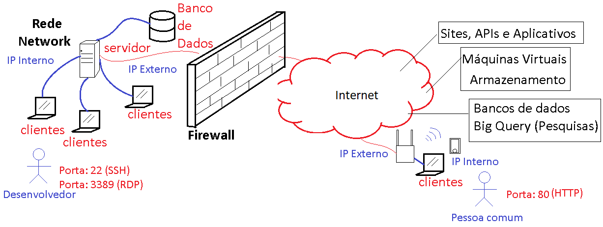

# Aula06
## Redes de computadores
- 2.5. Protocolo
  - 2.5.1. TCP/IP
  - 2.5.2. UDP
  - 2.5.3. FTP
- 2.9. Segurança de Redes
- 2.10. Firewall
- 2.11. Serviços de redes
	- 2.11.1. DNS (Domain Name System)
	- 2.11.2. DHCP (Dynamic Host Control Protocol)
	- 2.11.3. Webserver
	- 2.11.4. FTP

## Protocolos de comunicação
Protocolo é o nome dado a um conjunto de regras que os computadores devem seguir para que a comunicação entre eles permaneça estável e funcional. Resumindo, computadores diferentes, numa mesma rede, só se entendem se falarem a mesma língua (o protocolo).

### Modelo OSI
ISO foi uma das primeiras organizações a definir formalmente uma forma comum de conectar computadores. Sua arquitetura é chamada OSI (Open Systems interconnection), Camadas OSI ou Interconexão de Sistemas Abertos. 
Esta arquitetura é um modelo que divide as redes de computadores em sete camadas, de forma a se obter camadas de abstração. Cada protocolo implementa uma funcionalidade assinalada a uma determinada camada.
- 7 Camada de aplicação
- 6 Camada de apresentação
- 5 Camada de sessão
- 4 Camada de transporte
- 3 Camada de rede
- 2 Camada de enlace
- 1 Camada física

Como o nome diz OSI é um Modelo para Criação e utilização de protocolos e não um
protocolo de comunicação.

### Protocolo TCP/IP
Para a Internet, foi criado um protocolo chamado TCP/IP (Transmission Control Protocol / Internet Protocol) que tem como característica principal o fato de que cada computador ligado à Rede deve possuir um endereço, chamado endereço IP, distinto dos outros. O Endereço IP é formado por 4 números, que variam de 0 a 255, separados por pontos, como no exemplo:  203.12.3.124 ou em 2.255.255.0 ou até 17.15.1.203. 
Dois computadores não podem ter, ao mesmo tempo, o mesmo endereço IP, isso
acarretaria problemas no recebimento de qualquer tipo de informações. Para certificar-se que não haverá dois computadores com o mesmo endereço IP na Internet – que é muito vasta – foi desenvolvido um sistema de atribuição automática desse endereço. 
Quando um computador se conecta na Internet, através de um provedor, este recebe o endereço IP de um servidor localizado na empresa que provê seu acesso. Este servidor não vai atribuir aquele endereço IP a nenhum outro computador que se conectar enquanto este ainda permanecer on-line. Após a saída (desconexão) do computador, o endereço IP poderá ser atribuído a qualquer outro computador. 
Nas redes internas, em empresas, normalmente os endereços IP são fixos, ou seja, cada máquina já traz consigo seu endereço cabe ao administrador da rede projeta-la para evitar conflitos com outras máquinas. O protocolo TCP/IP não é apenas um protocolo, é um **conjunto** deles, para que as diversas “faces” da comunicação entre computadores sejam realizadas, podemos citar alguns dos protocolos que formam esta complexa “língua”:

* **TCP** (Protocolo de Controle de Transmissão): Protocolo responsável pelo“empacotamento” dos dados na origem para possibilitar sua transmissão e pelo
“desempacotamento” dos dados no local de chegada dos dados **com validação de integridade**.
* **UDP** (Protocolo de Transmissão Streaming): Protocolo responsável pelo“empacotamento” dos dados na origem para possibilitar sua transmissão e pelo
“desempacotamento” dos dados no local de chegada dos dados, **sem validação de integridade**.
* **IP** (Protocolo da Internet): Responsável pelo endereçamento dos locais (estações) da rede (os números IP que cada um deles possui enquanto estão na rede).
* **POP** (Protocolo de Agência de Correio): Responsável pelo recebimento das
mensagens de Correio Eletrônico.
* **SMTP** (Protocolo de Transferência de Correio Simples): Responsável pelo Envio das
mensagens de Correio Eletrônico.
* **HTTP** (Protocolo de Transferência de Hiper Texto): Responsável pela transferência de Hiper Texto, que possibilita a leitura das páginas da Internet pelos nossos Browsers (programas navegadores).
* **FTP** (Protocolo de Transferência de Arquivos): Responsável pela Transferência de arquivos pelas estações da rede.
 
Assim como no modelo OSI o protocolo TCP/IP também é dividido em camadas, porem
somente 4:
- Camada 4: A camada de Aplicação
- Camada 3: A camada de Transporte
- Camada 2: A camada de Internet
- Camada 1: A camada de Rede

## Segurança de rede
A segurança de rede é um conjunto de regras e configurações que tem como objetivo proteger os dados trafegados em uma rede de computadores. A segurança de rede é um dos principais desafios para as empresas que utilizam a internet como meio de comunicação entre seus funcionários, clientes e fornecedores.
## Firewall
Firewall é um sistema de segurança que monitora o tráfego de dados entre a rede interna e a rede externa, ou seja, a internet. O firewall é um sistema de segurança que monitora o tráfego de dados entre a rede interna e a rede externa, ou seja, a internet.

## Serviços de redes
Abaixo uma lista dos serviços mais comuns de rede.
### DNS (Domain Name System)
Serviço de resolução de nomes, ou seja, converte nomes em endereços IP e vice-versa.
### DHCP (Dynamic Host Control Protocol)
Serviço de distribuição de endereços IP dinâmicos.
### Webserver
Serviço de hospedagem de páginas web, servidores:
- NGINX
- Apache
- IIS
- Tomcat
- Node.js
### FTP
Serviço de transferência de arquivos.
