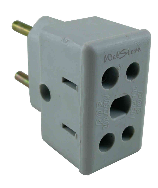

# Estrutura - Adapter

O padrão de projeto **Adapter** é usado para converter a interface de uma classe em outra interface que o cliente espera. Isso permite que classes com interfaces incompatíveis trabalhem juntas. Aqui está um exemplo de como usar o padrão Adapter em **JavaScript**:

|Problema|
|-|
|Converter um código em outro ex. MySQL em POSTGRESS|
||

```javascript
// Classe existente com interface incompatível
class CalculadoraAntiga {
  multiply(a, b) {
    return a * b;
  }
}

// Interface esperada pelo cliente
class Calculator {
  multiply(x, y) {}
}

// Adaptador que converte a interface CalculadoraAntiga em Calculator
class CalculatorAdapter extends Calculator {
  constructor() {
    super();
    this.CalculadoraAntiga = new CalculadoraAntiga();
  }

  multiply(x, y) {
    return this.CalculadoraAntiga.multiply(x, y);
  }
}

// Exemplo de uso:

const calculator = new CalculatorAdapter();

const result = calculator.multiply(3, 4);
console.log(result); // Saída: 12
```

Neste exemplo, temos uma classe existente chamada **CalculadoraAntiga** que possui uma interface incompatível com a interface esperada pelo cliente, que é definida na classe **Calculator**. Para permitir que o cliente utilize a CalculadoraAntiga, criamos um adaptador chamado CalculatorAdapter que estende a classe Calculator e encapsula uma instância da CalculadoraAntiga.

O **CalculatorAdapter** converte as chamadas de método da interface Calculator em chamadas de método correspondentes na CalculadoraAntiga. No exemplo, o método multiply do CalculatorAdapter simplesmente chama o método multiply da CalculadoraAntiga e retorna o resultado.

Dessa forma, o adaptador CalculatorAdapter permite que o cliente utilize a CalculadoraAntiga como se fosse uma instância de Calculator, mesmo que suas interfaces sejam diferentes. O cliente não precisa conhecer os detalhes da implementação do adaptador e pode interagir com ele como se estivesse lidando com a interface esperada (Calculator), obtendo os resultados corretos.