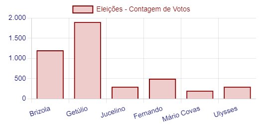

# Recursos avançados - Gráficos - ChartJS
## Documentação:
- ChartJs Docs - http://www.chartjs.org/docs/
## Exemplo
```html
<!DOCTYPE html>
<html lang="en">

<head>
  <meta charset="UTF-8">
  <meta http-equiv="X-UA-Compatible" content="IE=edge">
  <meta name="viewport" content="width=device-width, initial-scale=1.0">
  <title>Document</title>
</head>
<script src="https://cdn.jsdelivr.net/npm/chart.js"></script>

<body style="display: flex;flex-direction: column;align-items: center;">
  <div style="width: 500px;">
    <canvas id="myChart"></canvas>
  </div>

</body>
<script>
  const ctx = document.getElementById('myChart');
  const dados = {
    candidatos: ['Brizola', 'Getúlio', 'Jucelino', 'Fernando', 'Mário Covas', 'Ulysses'],
    votos: [1200, 1900, 300, 500, 200, 300]
  }

  Chart.defaults.font.size = 14;
  Chart.defaults.color = '#000066';

  new Chart(ctx, {
    type: 'bar',
    data: {
      labels: dados.candidatos,
      datasets: [
        {
          label: 'Eleições - Contagem de Votos',
          data: dados.votos,
          borderWidth: 2,
          backgroundColor: '#EECCCC',
          borderColor: '#880000'
        }
      ]
    },
    options: {
      scales: {
        y: {
          beginAtZero: true
        }
      },
      color: '#880000'
    }
  });
</script>

</html>
```
### Resultado:


## Mais exemplos:
- https://wellifabio.github.io/clima/
- https://github.com/wellifabio/wellifabio.github.io/tree/master/clima